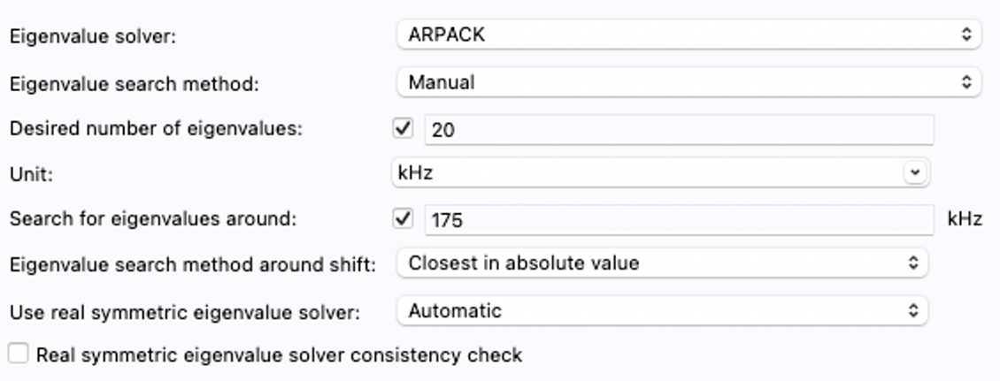

# Step 7: Search for Eigenvalues

[⇦ back](../README.md)

## Study settings

The follow settings can be find in ***Study1*** →***Step1:Eigenvalue***.

The following setting is required/able to be changed:

- Desired number of eigenvalues：tick the box and input the wanted number of eigenfrequencies. The more eigenfrequencies, the longer time it takes.
- Unit：Units in the drop-down menu are all units of angular velocity. An unit of frequency needs to be manually input, like kHz or MHz.
- Search for eigenvalues around：If this value is largely different from the real value, the searching time will be long or even cannot be found.
- Eigenvalue search method around shift：If the relation (for example, the real part is larger) between the real value and the value above is known, this setting can save much time.

## Reference Eigenfrequencies（optional）

Searching eigenfrequencies for piezoelectric devices usually takes several minutes or even dozens of minutes. Therefore, searching a wanted mode may be a time-consuming task. We recommend to find the reference eigenfrequencies first. These reference eigenfrequencies are the eigenfrequencies of pure acoustic vibration, since searching for reference eigenfrequencies usually only take several seconds, and it will be close to the real eigenfrequencies.

Note that not all modes have reference eigenfrequencies, especially those with large coupling coefficients.