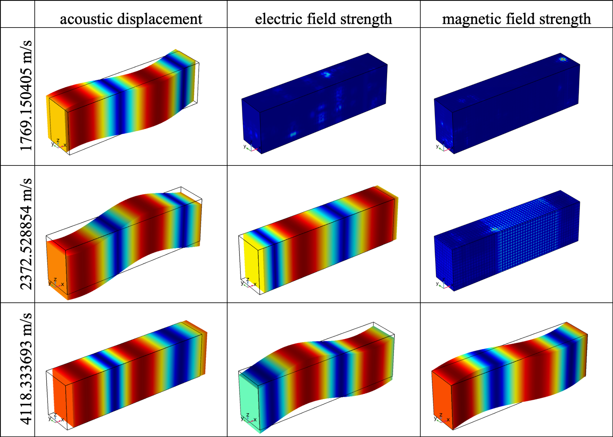
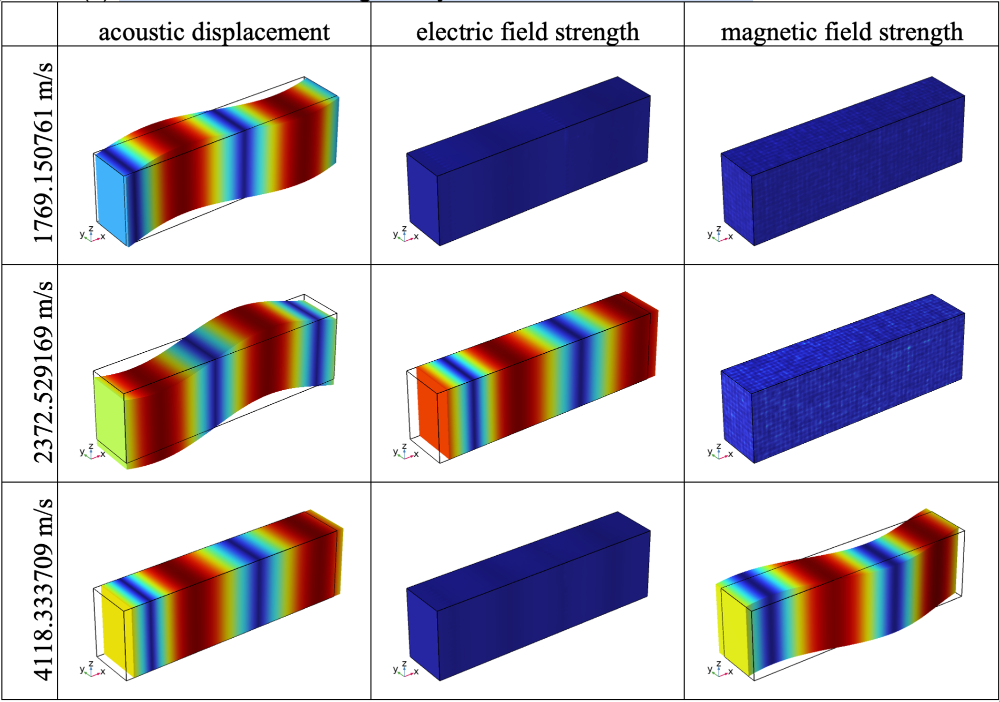

# Why not using the AC/DC module?

[⇦ back](../README.md)

## Question

I am not sure if the authors are aware of the AC/DC module in COMSOL Multiphysics. By coupling the AC/DC module with the Solid Mechanics module, the authors should be able to simulate the magnetic field along with the piezoelectric responses. It seems that the authors only used the electrostatic module before. I have successfully simulated both electromagnetic field and acoustic wave propagation of lithium-niobate-based SAW devices in COMSOL. Therefore, I don't think this manuscript is innovative or original enough.

## Reply

We are not sure what exact method you used. We contacted the COMSOL Support Team and received an official reply, where the engineer suggested to us to use the *Electrostatic* and *Magnetic Field* interfaces in the AC/DC module, where the variable *current density* J connects those two interfaces. Without further input from Referee 1, we can only assume this suggested method is the one she or he used and call it AC/DC method for short.

Potentially, there are four drawbacks of this AC/DC method:

1. There is no back coupling in the AC/DC method. This point is demonstrated with an example in question 2 below.

2. The results are less accurate. We demonstrate this drawback with examples in the Supplementary Material Section V.

3. The results given by AC/DC method are not correct. Below, we prove this point by simulating the partial waves of X-axis-propagating partial waves in PZT-5H using our method and AC/DC method and comparing the results with analytical results. The AC/DC method can only simulate 8 of the 9 required fields.

   To facilitate understanding, we here quickly supply some necessary background material: “Partial waves” are basically bulk waves propagating along a certain direction. They are five solutions of the coupled Christoffel equations (equation (8.117) in Auld’s book[^(1)], Volume I). But we only focus on 3 partial waves where the acoustic energy dominates, because they mainly consist of the fundamental vibration modes of piezoelectric devices. We use partial waves because the corresponding model is easy to construct and solve in COMSOL, yielding velocities (then the frequencies) and polarizations. The following are exact analytical results:

   | Velocity (m/s) | polarization of displacement | property        | E-field exist? | H-field exist? |
   | -------------- | ---------------------------- | --------------- | -------------- | -------------- |
   | 1769.1504      | along Y-axis                 | purely acoustic | no             | no             |
   | 2372.5287      | along Z-axis                 | stiffened       | yes            | no             |
   | 4118.3329      | along X-axis                 | quasi-acoustic  | yes            | yes            |

   Here are the results of our method and AC/DC method:

   This color bar is valid for all 18 figures below.

   

   * The simulation results of our FEM method:

   

   * The simulation results given by the built-in AC/DC *method*:

   

   Comparing the results one can find that there is a lack of electric field corresponding to the velocity of 4118.3329 m/s in the AC/DC method. That means the AC/DC method fails to completely simulate the required fields in the piezoelectric material. Besides, one may also find that the velocities given by the AC/DC method are less accurate than the ones given by our method.

4. The AC/DC module cannot solve radiating problems because it lacks the corresponding boundary conditions such as the *Scattering Boundary Condition*. Perfectly matched layers (PML) are available for all modules, but not for the simulation of piezoelectric devices (the thickness of the PML should be in the same order as the wavelength of the electromagnetic field, which is several thousand times larger than the size of devices). However, in our research, we expect to solve radiating problems using COMSOL.

[^(1)]: Auld BA. Acoustic Fields and Waves in Solids. Acoustic fields and waves in solids. New York ; Wiley; 1973.

